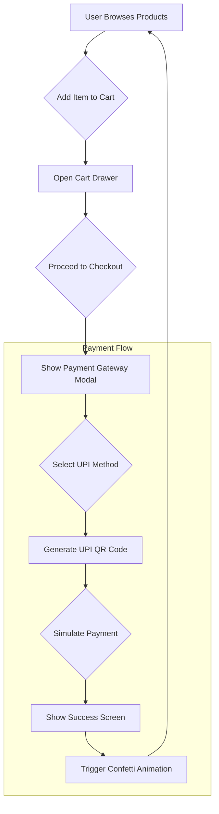

# E-Commerce UPI Payment Gateway Demo

## Project Aim
This project is a high-fidelity prototype of an e-commerce store, built as a single-file web application. Its primary purpose is to demonstrate a complete user purchasing flow, culminating in a realistic mock of an Indian UPI (Unified Payments Interface) payment gateway.

## Technical Implementation
This application is uniquely architected as a "zero-build" single-page application contained entirely within one `index.html` file.
- **React and JSX** are rendered directly in the browser, with in-browser compilation handled by the Babel Standalone CDN.
- All **dependencies** (React, ReactDOM, qrcode.js) are loaded from CDNs.
- **Styling** is achieved using Tailwind CSS, with the configuration object embedded directly in the HTML file.

This setup allows for rapid prototyping and easy sharing of a complex, interactive application without requiring a build environment.

## Key Features
- **Mock E-Commerce Flow:** Simulates a complete shopping experience from browsing products to adding items to a cart and checking out.
- **Realistic UPI Payment Modal:** On checkout, the app displays a payment gateway that mimics real-world Indian payment systems, including options for UPI, Card, and Netbanking.
- **Dynamic QR Code Generation:** The UPI option generates a scannable QR code based on the cart total using the `qrcode.js` library.
- **Interactive UI:** Features a toggle for "Admin Mode," a sliding cart drawer, and a confetti effect upon successful payment.

## Setup Instructions
- No installation is required.
- Open the `index.html` file directly in a web browser to run the application.

## System Diagram

